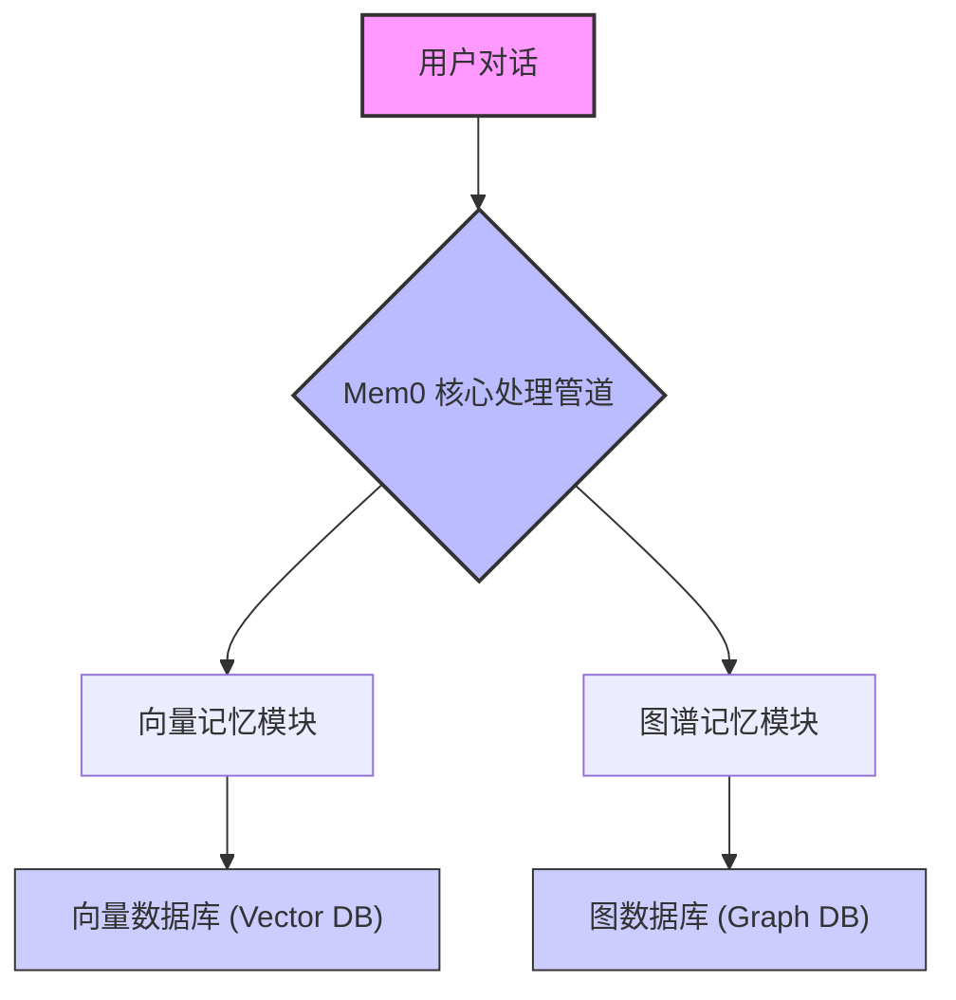
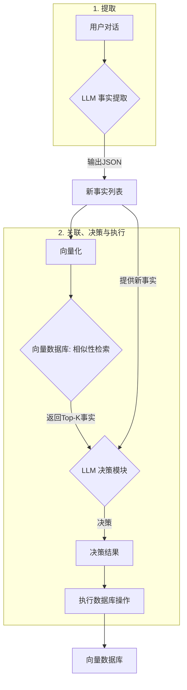
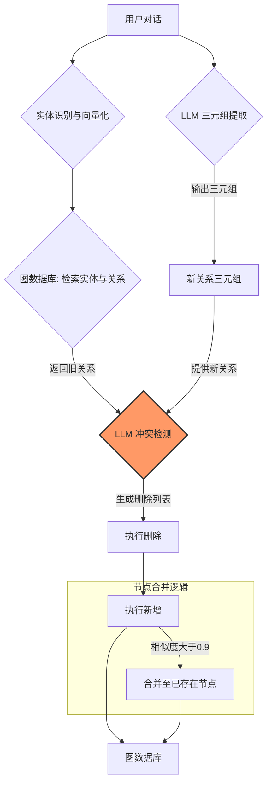
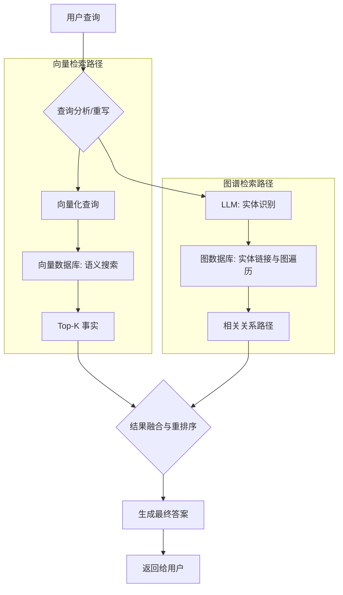

# Mem0 源码架构解析

### **前言**

本文档基于对 Mem0 开源项目的核心逻辑分析，旨在通过文字说明与流程图，解析其**混合记忆架构 (Hybrid Memory Architecture)**。Mem0 结合了**向量记忆**与**图谱记忆**，用于实现对信息的动态存储、更新与检索。

### **1. 核心架构总览**

Mem0 的系统采用双轨并行的记忆引擎。输入的用户对话会被分发到两个独立的模块进行处理和存储，形成一个互补的记忆库。

* **向量记忆 (Vector Memory)**: 存储离散的、基于语义的“事实”。
* **图谱记忆 (Graph Memory)**: 存储结构化的、基于关系的“知识”。

**【图1：Mem0 混合记忆系统高层架构图】**

---

### **2. 数据写入模块：记忆的形成**

此环节负责将输入数据转换为持久化、结构化的记忆，包含向量和图谱两条并行的处理流水线。

#### **2.1. 向量记忆插入流程：记录“事实”**

此流程将对话内容转化为独立的、可检索的事实条目，并管理其生命周期。

**流程说明:**

1.  **事实提取**: 通过 LLM Prompt 从对话中抽取出事实，并格式化为 JSON。
2.  **关联检索**: 将新事实向量化，在向量数据库中检索 K 个最相似的已有事实。
3.  **LLM 决策**: LLM 比较新旧事实，并做出 `新增`、`更新` 或 `忽略/删除` 的决策。
4.  **执行**: 根据 LLM 的决策，对数据库进行相应的操作。

**【图2：向量记忆插入流程图】**

#### **2.2. 知识图谱插入流程：构建“关系”**

此流程旨在构建一个反映实体间关系的图网络，其包含“先查后写”和“冲突检测”机制。

**流程说明:**

1.  **三元组提取**: 从对话中提取 `(源实体, 关系, 目标实体)` 格式的三元组。
2.  **图内实体检索**: 将提取出的实体向量化，在图数据库中查找已存在的对应节点，用于**实体链接**。
3.  **关系冲突检测**: LLM 审视新提取的三元组和从图中检索到的相关旧关系，并根据预设指南（如过时、矛盾则删除），生成一个“待删除关系列表”。
4.  **先删后增**: 系统先执行删除操作，再执行新增操作。
5.  **节点合并**: 新增节点时，若其与某个旧节点的向量相似度超过阈值 (如 0.9)，则自动合并，将关系指向旧节点。

**【图3：知识图谱插入流程图】**

> **设计分析**: 关于“关系类型”的规范化与丰富化是一个架构权衡点。当前流程展示了一个高度规范化的写入过程，通过 LLM 的决策来管理图谱数据的一致性。

---

### **3. 数据检索模块：记忆的唤醒**

当用户发起查询时，系统会并行查询两个记忆库。

**流程说明:**

1.  **查询分析**: 用户的自然语言查询可先通过 LLM 进行意图分析或查询重写。
2.  **并行检索**:
    * **向量路径**: 查询被向量化，在向量库中进行语义搜索，召回相关“事实”。
    * **图谱路径**: 从查询中识别出实体，链接到图中的节点，然后遍历图谱以查找相关的关系路径。
3.  **结果融合与重排**: 对从两个路径召回的结果进行统一排序（Rerank）。
4.  **生成答案**: 将排序后的信息整合，生成自然语言答案返回给用户。

**【图4：混合检索流程图】**

### **总结**

Mem0 的架构展示了向量数据库与知识图谱的结合应用。

* **混合模式**: 结合向量的语义匹配能力和图谱的关系表达能力。
* **写入时处理**: 在数据写入阶段通过 LLM 进行去重、更新和冲突检测，以管理数据质量。
* **数据一致性**: 通过实体链接和节点合并机制维护知识图谱的结构。
* **可优化点**: 系统的各个模块，尤其是在检索和重排序环节，存在进一步优化的空间。
        
